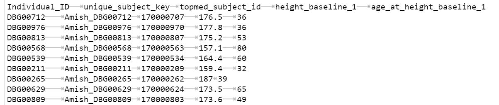
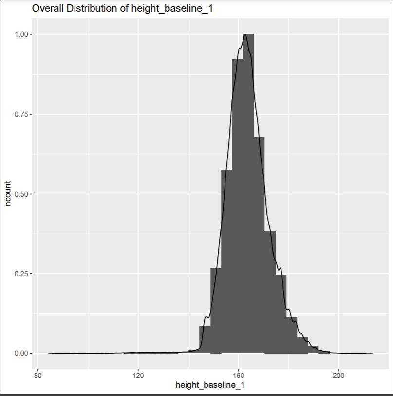
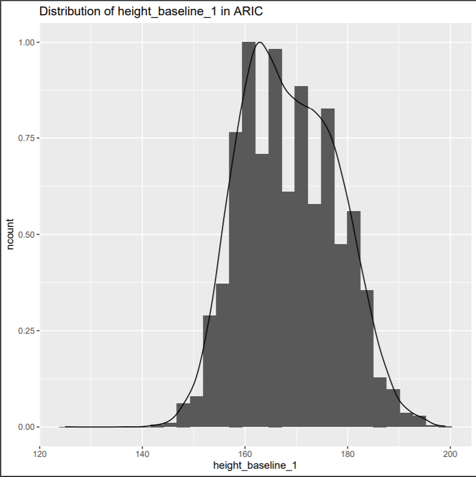
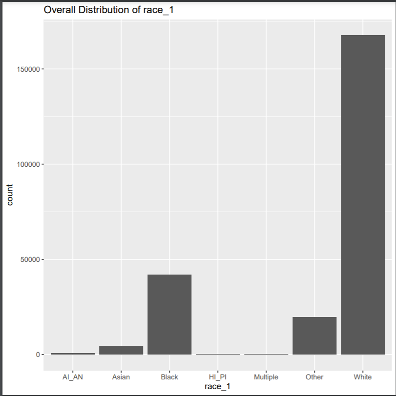
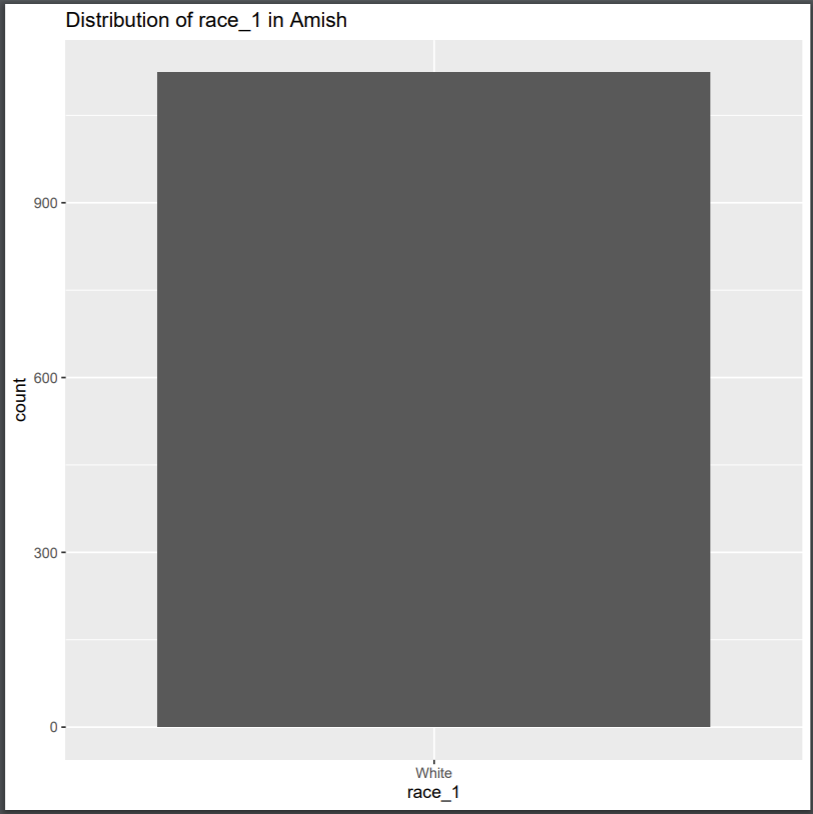

# TOPMed Phenotype Harmonizer Tool


## Introduction

The TOPMed Program is an initiative by the NHLBI to create and compile more resources for research in heart and lung problems. As such, TOPMed consists of more than 80 comprehensive studies with varying study designs and objectives. The goal of phenotype harmonization is to horizontally concatenate datasets for individual phenotype variables across different studies. Researchers at the University of Washington have created a system and syntax for describing the harmonization process, and have made that documentation available on their GitHub repository (https://github.com/UW-GAC/topmed-dcc-harmonized-phenotypes/). Thus far, the repository contains the complete documentation for 63 separate harmonized phenotype variables, across 17 distinct studies.


## Objective

The overall objective is to reproduce the datasets described by the documentation for all the studies available on the Institute's internal servers. After initial data exploration, a script was developed in R to streamline the process of generating the harmonized datasets.


## Background Information

The existing documentation describes the harmonization process for 17 studies. Here is a table explaining the status of those studies in the Institute's internal servers. The names used to identify these studies are those used in the phs-mapping file, and they may be named differently on STSI servers. For example, names are often in an unabbreviated form in the internal servers, Cardiovascular Health Study vs CHS in the mapping file :

| Study Available, Version matches documentation | Study Available, Version does not match documentation | Study Unavailable |
| ---------------------------------------------- | ----------------------------------------------------- | ----------------- |
| CHS                                            | Amish                                                 | GOLDN             |
| FHS                                            | COPDGene                                              | Mayo_VTE          |
| HCHS_SOL                                       | ARIC                                                  | SAS               |
| JHS                                            | Cleveland                                             |                   |
| MESA                                           | GENOA                                                 |                   |
| WHI                                            | HVH                                                   |                   |
| CARDIA                                         | CRA                                                   |                   |

The documentation was created on deprecated versions for 7 of the studies, but there were no issues identified with using the newer available version of those studies for harmonization on any of the 63 variables. For the purposes of the tool, only the 3 studies which are unavailable on the server, are not included in the harmonized dataset.


## Tool Usage and Functions

In order to create the harmonized dataset for a given variable, the following needs to be run on a terminal, within the working directory that contains the documentation. This command generalizes to bash terminals:

```bash
[user]$ Rscript Automation.R [(phenotype_concept)_(concept_variant)]
```

This command generally handles all of the 63 currently available variables without issues. There are a few caveats in the sequence in which certain variables need to be run. This is because some harmonized variables are constructed from other previously harmonized variables. The situations that need to be accounted for, are as follows:

- *bmi_baseline_1* : *height_baseline_1* and *weight_baseline_1* need to be run first.
- *ldl_1*: *total_cholesterol_1*, *triglycerides_1* and *hdl_1* need to be run first.
- *vte_prior_history_1*: *vte_followup_start_age_1* needs to be run first.
- *vte_case_status_1*: *vte_prior_history_1* needs to be run first.

In all other situations, running the above command will generate two files in the working directory, typically within a minute even for large datasets. The terminal displays the total number of observations as a point of comparison against the expected harmonization results which are detailed in the paper published by the UW-GAC and TOPMed DCC.

The first output file *phenotype_concept_concept_variant_harmonized.tsv* is a tab-separated values file that contains the harmonized dataset. To work with the dataset in an R analysis environment, the following code will allow the import of the data frame:

```R
read.table(file_name, head = TRUE)
```

The second output file is a companion pdf *phenotype_concept_concept_variant.pdf*, that describes the distributions of the studies that formed the harmonized dataset. Within the 63 phenotypes, there are various variables of both continuous and discrete data types. For continuous variables, histograms are generated as a default to describe the distributions, whereas for discrete variables, bar plots are generated for all the encoded values for that variable.


## Files required in the Working Directory for Harmonization

- phen_harm.R : This file contains all the constants, and functions required to read in the required datasets from phenotype files. This is adapted using the code available through dbgaptools.
- phs-mapping.tsv: This file maps the study names to their phs number and also contains data about their location on internal servers, required to parse their filepaths.
- [phenotype_concept_variant].json: The documentation file from UW-GAC that contains the necessary information to conduct the harmonization.
- Automation.R


## Process Results Summary

The tool is able to successfully handle all 63 phenotype variables, with only 1 minor change made to a base documentation file (some deprecated code was removed from *ldl_1.json*). Compared against the expected results described by the DCC, here is the status of the harmonized datasets on the internally available studies:

| Category                                                     | No of Variables | Notes                                                        |
| ------------------------------------------------------------ | --------------- | ------------------------------------------------------------ |
| Completely Successful Harmonization                          | 44              | All the variables for Atherosclerosis, Blood Cell Count and Inflammation, along with Hispanic Subgroup (Demographics), Lipid Lowering Medication (Lipids), VTE Followup Start Age and VTE Prior History (VTE) |
| Lower Observation Count due to dropped missing studies       | 16              | All the variables for Blood Pressure and Baseline Covariates, Ethnicity and Geographic Site (Demographics), Fasting Lipids, HDL, Cholesterol and Triglycerides (Lipids), VTE Case Status (VTE) |
| Higher Observation Count (Presumed reason is the change in version accession) | 3               | Sub-cohort, Race, Sex (Demographics)                         |


## Example use of tool

This section will illustrate the use of the tool for one of the 63 harmonized phenotype variables, the height variable. According to the documentation available through the UW-GAC, the variables are named as a combination of the phenotype concept and the concept variant. So, the height variable is named height_baseline_1 on the documentation, and this is the variable name to be used in the harmonization. So, the first step is to run the following line on the terminal, after verifying that the working directory contains the necessary files.

```bash
[user]$ Rscript Automation.R height_baseline_1
```

This step generally takes under 1 minute to finish running, unless there are any major underlying issues. After the command finishes running, there will be two additional files in the working directory: **height_baseline_1_harmonized.tsv** and **height_baseline_1.pdf**.


To analyze the dataset in a more user-friendly format, the tsv file can be imported easily as a data frame in an R environment like RStudio or Jupyter Notebooks, or any other equivalent environments for other programming languages. The following syntax will allow viewing the dataset in R:

```R
read.table('height_baseline_1_harmonized.tsv', header = TRUE)
```


Here is a snippet of the harmonized dataset, created as an output:




All the harmonized datasets across the different phenotype concepts, have almost identical column structures. The first three columns, **Individual_ID**, **unique_subject_key** and **topmed_subject_id** are all subject identifiers. Out of those, topmed_subject_id and unique_subject_key can both function as the primary key. Individual_ID is not a unique identifier across studies necessarily, but is the one column derived directly from the phenotype files and therefore, isn't dropped. The other two primary key columns are generated from subject variables in the available phenotype files.


The fourth column is the harmonized phenotype concept: **height_baseline_1**. The unit (cm) is standard across all the studies harmonized to create this dataset. 


Finally, the fifth column **age_at_height_baseline_1** provides information about the age of the subject at the point of measuring the phenotype concept. Not all phenotype concepts have information pertinent to age, recorded in their documentation. This is indicated in the has_age_variable (binary variable) found in the respective JSON file. The tool handles this, and will instead create a dataset with just the first four columns in the event that the age variable is not present. So, **a harmonized dataset will always either have 4 or 5 columns**, with the first four being standard across all 63 variables.


The other file that is generated will be named **height_baseline_1.pdf**, which contains descriptive visualizations of the distributions in the dataset. The first plot will be an overall distribution across the entirety of the harmonized dataset. The type of plot will depend on whether the variable is continuous or discrete. Here, height measured in centimeters is a continuous variable, and so, a histogram is generated as follows:




The histogram also shows a smooth curve that follows the general shape of the distribution. After this first plot, there are plots generated for each of the sub-cohorts that were concatenated to form the overall dataset. This provides information about the nature of participants in those studies, as it pertains to this specific variable. Since the different studies have different designs and exclusion criteria, the distributions are often not similar across different studies. The following picture shows the distribution for one of the sub-cohorts, ARIC:




Not all the phenotype concepts are continuous variables. For example, the phenotype concept race_1 is a discrete variable with encoded values for the different races represented in the studies. Since a histogram is not an appropriate visualization for categorical/discrete variables, a standard bar plot is generated:




Compared to continuous variables, the difference between study designs for the different cohorts becomes much more evident in discrete variables. For instance, since all the participants in the Amish TOPMed study all identify as White, here is the bar plot generated for that sub-cohort of participants:




This, of course, is much different from the distributions in the other sub-cohorts and actually, even the overall distribution. However, viewing these individual distributions can provide a lot of insight into the characteristics of the different studies that go into harmonizing these datasets, if they are not readily obvious when parsing through the phenotype files.


## Status

From the data and files available at SRTI and the documentation available through the TOPMed DCC, all 63 phenotype concepts were harmonized to the maximum possible extent, with all the issues raised throughout this process, resolved at this point in time. As such, all 63 harmonized datasets and their 63 companion files are available for use. The dataset generation process is completely reproducible, in the event that further documentation for other phenotype concepts are released in the future by the DCC (Some customization might be required still, but a bulk of the code is generalizable as long as the documentation format remains consistent). 
